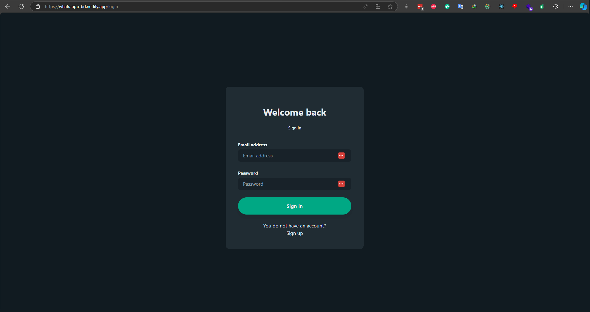

# Whatsapp Clone🗺️

🚀 [Live Version](https://whats-app-bd.netlify.app/ "Whatsapp"): https://whats-app-bd.netlify.app/

---

📃 Description:

    The WhatsApp clone is a messaging platform similar to the actual WhatsApp Messenger. In this application, user can log in and register, can send messages,  attach media to text messages, create groups, search for users, display user online status, show when a user is typing, make video calls, and send emojis. This is a practice project for learning Socket.io and WebRTC.

---

⚙️ Technologies:

    Frontend: HTML, CSS, JavaScript, React, Redux
    Backend: Node.js, ExpressJS, Socket.io, WebRTC
    Database: MongoDB
    Storage: Cloudinary

---

📷 Screen Shots:

